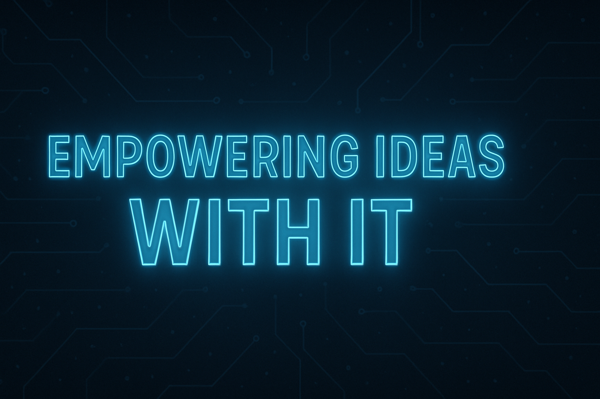

<link rel="preconnect" href="https://fonts.googleapis.com">
<link rel="preconnect" href="https://fonts.gstatic.com" crossorigin>
<link href="https://fonts.googleapis.com/css2?family=Lato&display=swap" rel="stylesheet">

    

## Fun fact
### Hobby
PC💻, Gadget📱, Various OS💿, Coffee (especially iced)☕, OSS development🆓

### Programming language
Javascript(Vanilla JS), HTML, CSS3, jQuery, Bootstrap, PHP, Laravel, ShellScript(sh, bash, PowerShell), awk script, Progressive web apps(PWA) 

### Economic activity
Gamification👾, Behavioral Economics🚶, Marketing automation📊

### Generative AI
Claude, ChatGPT, Gemini, Grok, NotebookLM, DALL-E3, Stable diffusion, Sora, GitHub Copilot, MS Copilot, Claude Code, ReCline-Legacy, Ollama, LMStudio, GPT4ALL

### Entertainer
Hiroyuki Oda, Masami Okui, Michael Jackson, Sheryl Nome, Yoko Kanno, Hayato Kagami

## On the web

  
 
  
 
 
 
  

## Profile

Hey there! I'm an IT engineer who's super into setting up dev environments and building web tools in my spare time. 

I'm also the supreme leader of the Okayama Iced Coffee Club – because let's be real, iced coffee is the ultimate drink! ☕️

I'm a firm believer in "multi-standardism" – basically, I think there are as many different versions of "normal," "common sense," and "obvious" as there are people in this world. Everyone's got their own take on what's standard, and that's totally cool with me!

## Activity

<!--  -->
<!--    -->
<!--  -->

