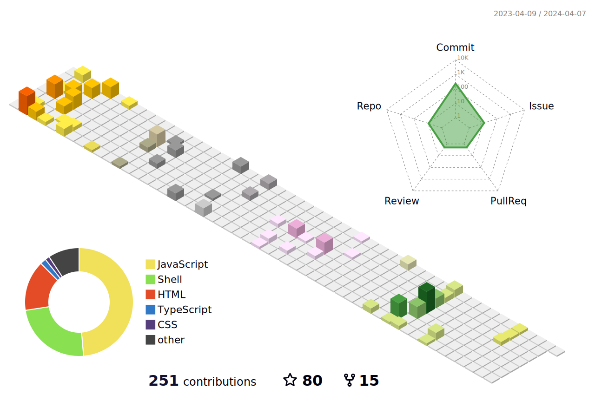

<link rel="preconnect" href="https://fonts.googleapis.com">
<link rel="preconnect" href="https://fonts.gstatic.com" crossorigin>
<link href="https://fonts.googleapis.com/css2?family=Lato&display=swap" rel="stylesheet">

    

## Fun fact
### Hobby
PC💻, Gadget📱, Various OS💿, Coffee (especially iced)☕, OSS development🆓

### Programming language
Javascript(Vanilla JS), HTML, CSS3, jQuery, Bootstrap, PHP, Laravel, ShellScript(sh, bash, PowerShell), awk script, Progressive web apps(PWA) 

### Economic activity
Gamification👾, Marketing automation📊, Robotic Process Automation🤖

### Entertainer
Hiroyuki Oda, Masami Okui, Michael Jackson, Sheryl Nome, Yoko Kanno

## On the web

[ @hidao80](https://github.com/hidao80/)  
[ @hidao<wbr>@social.vivaldi.net](https://social.vivaldi.net/@hidao)  
[ Qiita](https://qiita.com/hidao)  
[ Speaker Deck](https://speakerdeck.com/hidao80)  

## Profile

A humble IT hobbyist who enjoys building development environments and creating tools.  
I am the leader of the Okayama Iced Coffee Party. Iced coffee is supreme.  
I am a multi-standardist who believes that there are as many "norms" and "common sense" as there are people.

## Activity

<!--  -->
<!--    -->
<!--  -->

