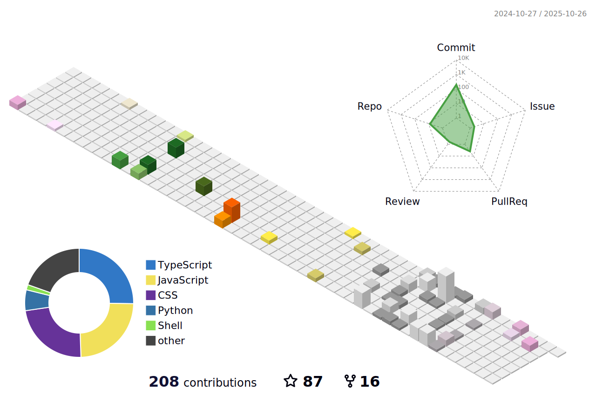

<link rel="preconnect" href="https://fonts.googleapis.com">
<link rel="preconnect" href="https://fonts.gstatic.com" crossorigin>
<link href="https://fonts.googleapis.com/css2?family=Lato&display=swap" rel="stylesheet">

    

- 🧩 Motto: **Build in Flow, Value for All — to us, our clients, and end users.**
- 🎯 Goal: Full-Stack Engineer Creating Business Value

## Fun fact
### Hobby
PC💻, Gadget📱, Various OS💿, Coffee (especially iced)☕, OSS development🆓

### Programming language
Javascript(Vanilla JS, Node.js), TypeScript, HTML, CSS3, jQuery, Bootstrap, PHP, Laravel, ShellScript(sh, bash, PowerShell), awk script, Python, Tcl/Tk 

### Economic activity
Gamification👾, Behavioral Economics🚶, Marketing automation📊, Investment Trust💰, Charitable donation🪙

### Generative AI
Claude, ChatGPT, Gemini, Gemini nano, Grok, MS Copilot, NotebookLM, DALL-E3, Stable diffusion, Sora, GitHub Copilot, Claude Code, Gemini-cli, ReCline-Legacy, Ollama, LMStudio, GPT4ALL, Cursor, Windsurf, Canva

### Entertainer
Hiroyuki Oda, Masami Okui, Michael Jackson, Sheryl Nome, Yoko Kanno, Hayato Kagami

## On the web

<!--   -->
 
  
 
 
 
  

## Profile

I'm an IT engineer who's passionate about setting up dev environments and building web tools in my spare time. 

I'm also the supreme leader of the Okayama Iced Coffee Club – because let's be real, iced coffee is the ultimate drink! ☕️

I'm a firm believer in "multi-standardism" – basically, I think there are as many different versions of "normal," "common sense," and "obvious" as there are people in this world. Everyone's got their own take on what's standard, and that's totally cool with me!

---

- 💡 **Core Philosophy**: Creating sustainable value through IT.
- 🖼️ **Vision**: Solving core problems with optimal tech.
- 📍 **Positioning**: Solution architect leveraging IT & AI to tackle business challenges.

## 🚀 Value Creation Initiatives
### **Core Strengths**
1. **Strategic thinking for maximizing multifaceted value creation from single resources**
   * Example: Developed a zero-risk, maximum-impact content strategy by decomposing technical learning into three targeted layers—beginner tutorials, technical deep-dives, and design philosophy—each optimized for specific platform audiences.
2. **Full-stack development with business value focus**
   * Delivered end-to-end solutions from infrastructure to user experience
   * Created 20+ GPTs for business process automation
   * Developed MCP servers for enhanced AI workflow integration
3. **AI-driven business process optimization**
   * Automated call notification systems reducing productivity loss
   * Implemented FAX notification filtering with Power Automate
   * Built custom tools for competitive analysis and email automation

## 🛠️ Tech Stack
### ⚡️ Currently in Use
- **Frontend**: JavaScript, HTML/CSS, jQuery, WebRTC API, Web Speech API, Geolocation API, Chrome extensions, Firefox extensions, VS Code extensions, Claude Desktop extensions, UserScript, PWA, bookmarklet
- **Backend**: PHP, Laravel, MySQL, Postgresql, SASS, Twig, Python
- **Infrastructure**: AWS, Azure, Linux, BSD, Windows Server, Apache, MariaDB, ssh, sendmail, Git, SubVersion, Docker, Vagrant, Ansible, Mackerel
- **Marketing**: WordPress, SEO, Google Ads, Facebook Ads, Markefun, press releases, listing on lead generation sites, Google Analytics 4, Google Search Console, Google Tag Manager, structured data (schema)
- **AI**: GitHub Copilot Chat, Claude, ChatGPT, MS Copilot, Gemini, NotebookLM, ReCline-legacy, DALL-E3, MCP Server, MCP config file
- **Chat tool**: Chatwork, Slack, LINE, Teams, Messenger, Discord, Matrix, Google Chat, Google Meet, Zoon, FaceTime
- **Knowledge base**: esa.io, OneNote, Google Keep, Redmime Wiki, Zenn.dev, qiita.com 

### 📚️ Currently Learning & Experimenting
- **Modern Frontend**: React + TypeScript + Vite, Vue.js, IndexedDB, Server Send Event (SSE), WebSocket API, WebPush API, Notification API
- **Modern Backend**: FastAPI, FastMCP
- **AI Development**: Codex CLI, Claude Code, Gemini-cli, v0, CodeRabbit, Replit
- **AI Integration**: MCP Server development
- **Certification**: IPA IT Strategist, Database specialist, JCCI Bookkeeping Level 3
- **Content Strategy**: Multi-platform technical writing

## Activity

<!--  -->
<!--    -->
<!--  -->

